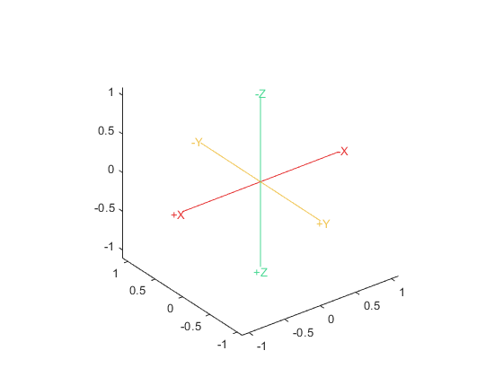
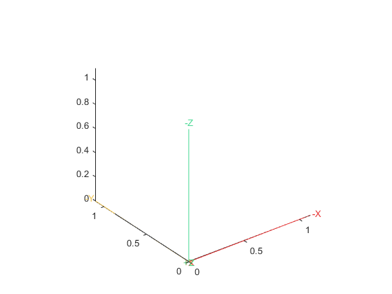
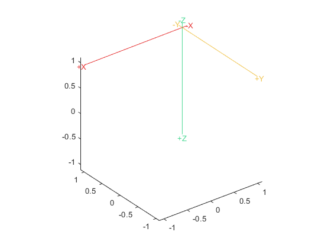
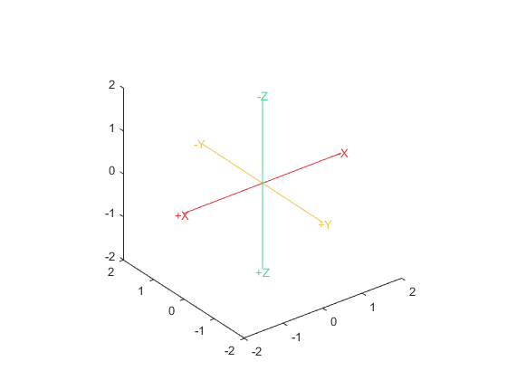
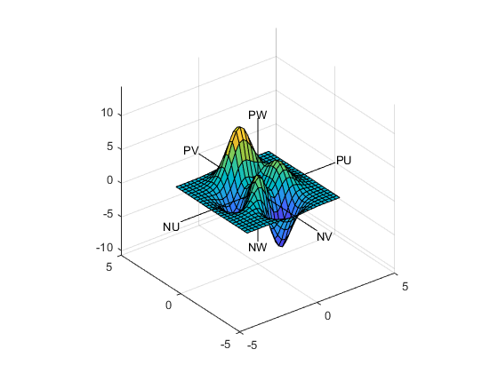

# PrettyAxes3D

Class for adding pretty axes to 3D MATLAB plots. When the `draw()` method of an instance is called, six axis lines are produced radiating from the supplied origin to the supplied minimum and maximum points, each parallel to the `XYZ` axes, colored independently. The default colors are colorblind safe; see below for more information. The end point of each axis is labeled by whether it is in the positive or negative direction, and by which axis it is parallel to. By default the labels are of the form `{-,+}{X,Y,Z}`. For example, the default positive `X`-axis is labeled `+X`, and negative `Z` is labeled `-Z`.

# Usage

To make use of the class functionality, construct an instance of class `PrettyAxes3D`, adjust any settings, and then call its `draw()` method.

### Constructor

The constructor accepts 0 to 3 arguments. If one argument is supplied, it is assumed to be the origin of the coordinate system. If two arguments are supplied, they are assumed to be the minimum and maximum point of whatever data set is being plotted. If three arguments are supplied, they are assumed to be the minimum, maximum, and origin, in that order. If no arguments are supplied, the origin is set to zero. Special behavior occurs in the `draw()` method when the minimum and maximum are not supplied.

### Method `draw()`

If the minimum and maximum are not supplied in the constructor, then the `draw()` method uses the limits of the supplied axes handle. If no axes handle is supplied, then the current axes is used with the same behavior as `gca()`.

### Settings

#### `set_*_labels()`

For `*=pos_neg` the supplied labels must be a character vector of length two. The first character is for negative axes, the second is for positive.

For `*=axis` the supplied labels must be a character vector of length three. The characters are for the `X`, `Y`, and `Z` axes, in indexing order.

#### `set_colors()`

The colors must be supplied as a 3-by-3 matrix whose rows are the RGB colors for the respective axis. The first row is for `X`, second for `Y`, third for `Z`. The color values must be in `[0,1]` The default colors are colorblind safe; see below for more information.
 
#### `set_scaling_factor()`

The scaling factor controls how far beyond the supplied minimum and maximum point the axes will extend. The scaling factor is a scalar numeric value which is multiplied by the extreme points.

#### `use_axes_*_point()`

Resets the minimum or maximum point to use the limits of the axes.

#### `set_axes_*_point()`

Sets the minimum or maximum point.

# Examples

Typical usage

No arguments

Origin at max point

Doubled scaling

Automatic minimum and maximum with `Peaks`

Same as above with custom colors and labels

# Colorblind Safety

Colorblindness safety of the default colors was tested using [ColorHexa](https://www.colorhexa.com/). The three default colors are close to [red](https://www.colorhexa.com/e63434), [yellow](https://www.colorhexa.com/f0c44f), and [green](https://www.colorhexa.com/4ad994). To compare, scroll down to the _Color Blindness Simulator_ header.
